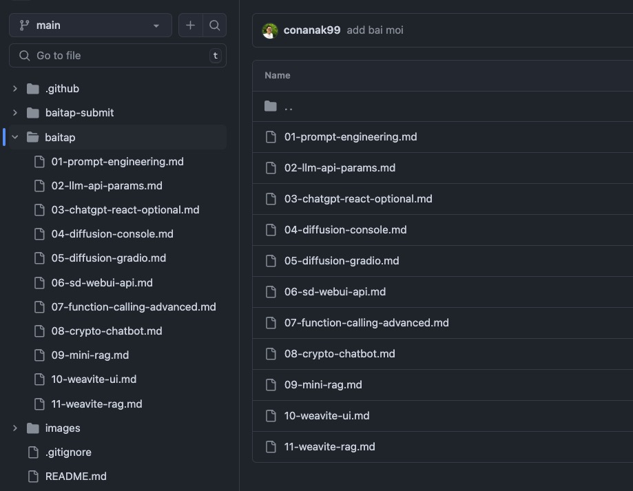
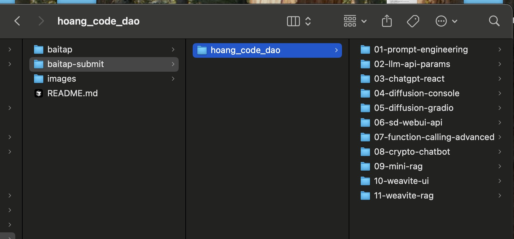

Nếu các bạn đã quên hoặc chưa từng dùng Git, bấm vào ảnh dưới để xem clip hướng dẫn dùng Git của Code Dạo nhé!

[](https://www.youtube.com/watch?v=1JuYQgpbrW0)

# Cách làm bài tập và nộp bài tập

Để làm và nộp bài tập các bạn hãy làm theo các bước sau.

## 1. Tìm đề bài, sau đó và fork, clone repo

1. Tìm bài tập tương ứng trong thư mục "baitap" của repo (Hoặc theo link mình để trong bài giảng).

   

2. Bấm `fork` để fork repo này về tài khoản cá nhân của bạn.

   

   

3. Pull code mới nhất về máy và code

   ```
   git clone https://github.com/[account]/hoccodeai-excerise.git
   ```

   

   Hoặc bạn cũng có thể đổi tên miền thành github.dev để code trực tiếp trên web `https://github.com/[account]/hoccodeai-excerise`

   

## 2. Làm bài và commit code

1. Trong thư mục `baitap-submit`, đổi thư mục `ten_cua_ban`, đổi tên thành tên của bạn.
2. Trong thư mục vừa đổi, sẽ có thư mục tương đương với tên từng bài tập.
3. Viết code để làm bài trong thư mục đó.

   

4. Bắt đầu làm bài và Commit các thay đổi vào code.
5. Nếu được thì nhớ commit message rõ ràng.

   ```
   git add .
   git commit -m "Đã hoàn thành bài tập [tên bài tập]"
   ```

6. Sau khi làm xong, push các commit này lên repo bên account của bạn

   ```
   git push origin main
   ```

7. Lâu lâu các bạn vào check, nếu repo gốc có thay dổi thì bấm `Update branch` để lấy code mới nhất.

   

## 3. Tạo Pull Request (PR) trên GitHub để nộp bài

1. Vào account và của bạn trên Github.
2. Bấm `Contribute` -> `Open pull request`

   

3. Thêm tiêu đề và mô tả cho PR của bạn, nhớ viết đầy đủ nha
4. Bấm `Create pull request`

   

5. Bạn đã nộp bài xong. Giờ chỉ cần chờ chấm điểm thôi.

## Thời gian review/chấm bài

Team mình sẽ review/góp ý cũng như chấm bài cho bạn vào cuối tuần.

Nhớ kiểm tra PR thường xuyên để xem có câu hỏi hoặc gợi ý nào không nhé.

> Nếu bạn cần giúp đỡ với quá trình này, đừng ngần ngại hỏi trong kênh Discord hoặc nhóm Facebook nha. Chúc bạn code vui vẻ!
