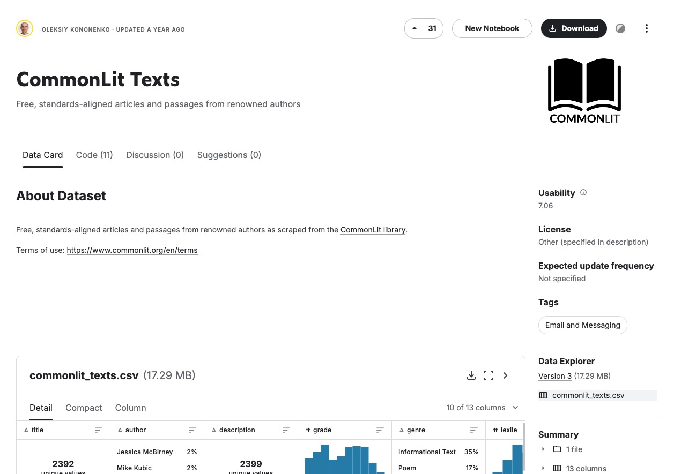

# Bài tập

Xây dựng một app để tìm kiếm sách tương tự như [bài 72 đã học] (https://hoccodeai.com/courses/ai-course/03-2-llm-advanced-projects/02-llm-project-weavite?lesson=weavite-ui).

Bạn có thể sử dụng [tập dữ liệu mẫu này từ Kaggle](https://www.kaggle.com/datasets/kononenko/commonlit-texts) để bắt đầu, nhớ bấm vào nút `Download` để tải về.

# Nội dung nộp bài

Viết và nộp file
- `insert-data.py` : Insert dữ liệu vào Weavite
- `book.py` : Tìm kiếm sách

Hoặc để link Colab cũng được.
